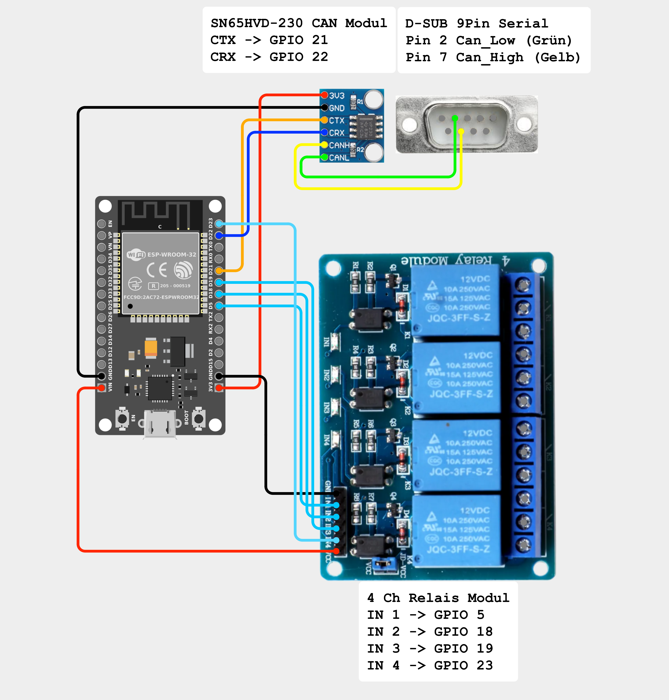
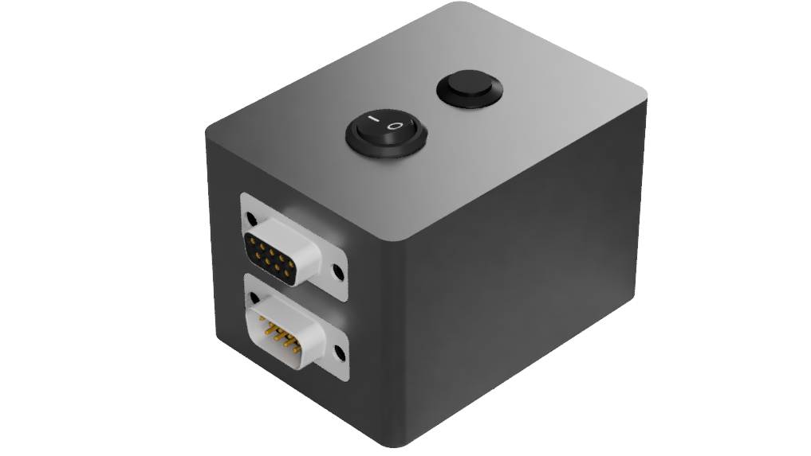

<p align="right">
<small><em>Klick mich</em></small><br>
  <a href="https://www.th-owl.de/en/studies/available-courses/degree-programs/detail/precision-farming/" target="_blank">
    
  </a>
</p>

# ISOBUS VT Relais Controller  
**ESP32 + AgIsoStack + IsoDesigner**


Dieses Projekt implementiert ein eigenes ISOBUS-Gerät auf Basis eines ESP32,
das sich an ein ISOBUS Virtual Terminal (VT) anmeldet und über Touch-Buttons
in der Datenmaske vier externe Relais schaltet.

Der ESP32 fungiert dabei als **Virtual Terminal Client** und nutzt die
Open-Source-Bibliothek **AgIsoStack** zur ISOBUS-Kommunikation.
Der VT-Object-Pool wurde mit dem **IsoDesigner** erstellt.


## Projektübersicht

Ziel dieses Projekts ist es, eine einfache und robuste ISOBUS-Bedieneinheit
zu realisieren, mit der digitale Ausgänge (hier Relais) direkt über ein vorhandenes
ISOBUS-Terminal geschaltet werden können.

Typische Anwendungsfälle:
- Schalten und steuern von elektrischen Komponenten 
- Prototyping von ISOBUS-Funktionen
- Lernen und Verstehen der ISOBUS-VT-Kommunikation


## Systemarchitektur

### Hardware-Komponenten
- ISOBUS Terminal 
- ESP32 Mikrocontroller
- [CanBus](https://www.amazon.de/dp/B0CPJ6HW9K?ref=ppx_yo2ov_dt_b_fed_asin_title) Modul SN65HVD-230
- 4-Kanal Relaismodul
- D-SUB 9Pin Stecker und Buchsen

### Software-Komponenten

- [IsoDesigner](https://www.bucherautomation.com/iso-designer/sw10133) (VT Object Pool Design)
- [VSCode](https://code.visualstudio.com) + [PlatformIO](https://platformio.org)
- [AgIsoStack](https://agisostack-plus-plus.readthedocs.io/en/latest/index.html) (ISOBUS Stack) 

---
## ESP32 Relais- und CAN-Modul


#### Schaltplan:

<p align="center">
  
</p>

#### CAD: 

<p align="center">
  
</p>

*Abbildung: ESP32 mit Relais und CAN Modul*


## ISOBUS Verteilerbox

Die Verteilerbox übernimmt folgende Aufgaben:
- Versorgung des ISOBUS Terminals mit Spannung
- Durchschleifen des CAN-Bus
- Abgriff von CAN High und CAN Low
- optionales zuschalten eines Abschlusswiderstands
- Verbindung zum ESP32 über DSUB-Steckverbinder
> Das Zuschalten des Abschlusswiderstands kann je nach Setup und Can-Modul notwendig sein.
> Der hier verwendete Can Transceiver hat einen entsprechenden 120 Ohm Widerstand on Board, wodurch der Widerstand nicht zugeschaltet werden muss.

In dem Gesamtaufbau hängt die Verteilerbox also zwischen dem Isobus Terminal und dem Esp32:

Terminal &harr; Verteilerbox &harr; ESP-Client


### Schaltplan: ISOBUS Verteilerbox

<p align="center">
  
</p>

#### CAD:

<p align="center">
  
</p>

*Abbildung: ISOBUS Strom- und CAN-Verteilerbox*

---
## Virtual Terminal Object Pool

### Was ist ein Virtual Terminal Object Pool?

Ein **Virtual Terminal Object Pool** (kurz: *Object Pool*) ist die vollständige,
maschinenlesbare Beschreibung der grafischen Benutzeroberfläche eines
ISOBUS-Gerätes gemäß **ISO 11783**.

Der Object Pool enthält **keinen Programmcode**, sondern ausschließlich
strukturierte Daten, die dem Virtual Terminal beschreiben:

- welche Masken (Screens) existieren
- welche grafischen Objekte enthalten sind (Buttons, Texte, Icons, etc.)
- welche Eigenschaften diese Objekte haben
- welche **Object-IDs** zur Identifikation verwendet werden

Das Virtual Terminal rendert diese Oberfläche selbstständig und übernimmt
die gesamte Darstellung und Bedienlogik.


## Dateityp und Format

Ein Object Pool liegt typischerweise als **binäre Datei mit der Endung `.iop`**
vor (*ISOBUS Object Pool*).

Eigenschaften der `.iop`-Datei:

- binäres, kompaktes Format
- standardisiert nach ISO 11783
- herstellerunabhängig
- nicht menschenlesbar
- enthält ausschließlich VT-Objekte und deren Attribute

Die `.iop`-Datei wird üblicherweise mit speziellen VT-Design-Werkzeugen
(z. B. Jetter IsoDesigner) erzeugt und anschließend in das ISOBUS-Gerät integriert.


## Übertragung und Speicherung im Virtual Terminal

Der Object Pool wird **nicht permanent zyklisch übertragen**.

Stattdessen erfolgt der Ablauf wie folgt:

1. Das ISOBUS-Gerät meldet sich am Bus an
2. Das Gerät erkennt ein verfügbares Virtual Terminal
3. Der Object Pool wird **einmalig** an das Terminal übertragen
4. Das Terminal speichert den Object Pool intern
5. Ab diesem Zeitpunkt rendert das Terminal die Oberfläche selbstständig

Nach erfolgreicher Übertragung:
- wird der Object Pool **nicht erneut gesendet**
- werden nur noch **Ereignisse (z. B. Button-Drücke)** übertragen
- bleibt die grafische Oberfläche auch bei kurzen CAN-Unterbrechungen erhalten

Ein erneutes Übertragen ist nur erforderlich, wenn:
- sich der Object Pool ändert
- das Terminal neu gestartet wird
- oder die Verbindung explizit neu aufgebaut wird

## Einbettung des Object Pools in die ESP32-Firmware

In diesem Projekt ist der Object Pool **fest in die Firmware des ESP32 eingebettet**.

Die `.iop`-Datei wird dabei:
- beim Build-Prozess als Binärdaten eingebunden
- vom Linker als Symbol in das Firmware-Image integriert
- zur Laufzeit aus dem Flash gelesen

Im Code erfolgt der Zugriff über vom Linker bereitgestellte Symbole:

```cpp
extern "C" const uint8_t object_pool_start[];
extern "C" const uint8_t object_pool_end[];
```

---

## Erstellung des Object Pools mit dem IsoDesigner


Der Object Pool dieses Projekts wurde mit dem [IsoDesigner](https://www.bucherautomation.com/iso-designer/sw10133) erstellt.


> ### Was ist der IsoDesigner?
> Der **IsoDesigner** ist ein grafisches Entwicklungswerkzeug zur Erstellung
> von ISOBUS Virtual-Terminal-Oberflächen gemäß ISO 11783.
> Er ermöglicht das visuelle Erstellen von Masken und Bedienelementen
> ohne manuelles Schreiben von Object-Pool-Strukturen.

Ein guter Einstieg in die Software ist auch über entsprechende [Tutorials](https://youtu.be/10cyF99BziY?si=aGUhjTgAsRmfgrT0) möglich.


### Vorgehensweise (vereinfacht)

1. Neues VT-Projekt im IsoDesigner erstellen
2. Virtuelles Terminal mit entsprechendem VT-Level als Zielgerät auswählen
3. Datenmaske anlegen
4. Vier Buttons platzieren
5. Jedem Button eine eindeutige **Object-ID** zuweisen
6. Button-Typ festlegen (Momenttaster oder rastend)
7. Projekt kompilieren
8. Export der `.iop` Datei (Object Pool)

Die erzeugte `.iop` Datei wird anschließend:
- ins ESP32-Firmwareprojekt eingebunden (`firmware/object_pool/ESP_Controler.iop`)
- beim Start des ESP an das Virtual Terminal übertragen

<p align="center">
  
</p>

*Abbildung: Datenmaske "Home" im IsoDesigner*

<p align="center">
  
</p>

*Abbildung: Button Container im IsoDesigner mit entsprechender ID*

---

## Firmware (ESP32)

Die Firmware wurde unter verwendung von  **VS Code** und **PlatformIO** geschrieben und auf dem ESP geflasht. Dabei wurde sich sehr eng an das [Tutorial](https://agisostack-plus-plus.readthedocs.io/en/latest/Tutorials/ESP32%20PlatformIO.html) von AgIsoStack gehalten.

### Hauptfunktionen

- CAN-Kommunikation über ESP32 TWAI Controller
- ISOBUS Address Claiming
- Virtual Terminal Client
- Übertragung des Object Pools
- Empfang und Auswertung von VT Key Events
- Ansteuerung der GPIO-Ausgänge

### ISOBUS-Einstellungen

- Baudrate: **250 kbit/s**
- CAN Filter: Accept All
- Unterstützt Arbitrary Address Claiming


## Technischer Ablauf

1. ESP32 startet
2. Initialisierung der GPIOs (Relais AUS)
3. Initialisierung des CAN-Controllers
4. ISOBUS Address Claiming
5. Suche nach einem Virtual Terminal
6. Übertragung des VT Object Pools
7. Benutzerinteraktion am Terminal
8. Empfang von Button-Events
9. Schalten der entsprechenden Relais


### Button- & Relais-Zuordnung

Die Object-IDs der VT-Buttons sind in dem Projekt mit folgenden GPIO's des ESP verknüpft:

| VT Object ID | Funktion     | ESP32 GPIO | Relais |
|-------------|--------------|-----------|--------|
| 6000        | Relais 1     | GPIO 5    | Ch1    |
| 6001        | Relais 2     | GPIO 18   | Ch2    |
| 6002        | Relais 3     | GPIO 19   | Ch3    |
| 6003        | Relais 4     | GPIO 23   | Ch4    |

### VT Button Eventhandling (AgIsoStack)
Das Laden/Übertragen des VT Object Pools ist nur die eine Seite.  
Damit aus einem Button auf dem Terminal tatsächlich eine Aktion im Gerät wird,
muss der ESP32 die **VT Key Events** auswerten, die das Terminal über ISOBUS sendet.

AgIsoStack stellt dafür im `VirtualTerminalClient` einen Event-Dispatcher bereit,
über den man Callback-Funktionen registrieren kann.


### Grundprinzip

1. Der VT rendert den Object Pool (Maske, Buttons, etc.)
2. Der Benutzer drückt oder löst einen Button
3. Der VT sendet ein **Key Event** über den ISOBUS CAN-Bus
4. AgIsoStack dekodiert dieses Event und triggert deinen Callback
5. Dein Callback wertet die **Object-ID** und den **KeyActivationCode** aus
6. Daraus leitet man die gewünschte Aktion ab (hier: Relais schalten)

## ⚠️ Hinweis: Object-Pool-Hash/MD5 aus dem AgIsoStack-Tutorial (ESP32)

Im AgIsoStack-VT-Tutorial wird optional ein Hash (MD5-basiert) aus dem Object Pool berechnet
(z. B. über `IOPFileInterface::hash_object_pool_to_version(...)`). Dieser Hash dient als „Version“,
damit ein Virtual Terminal entscheiden kann, ob es einen Object Pool erneut anfordern muss oder eine
gecachte Version laden kann.

Auf dem ESP32 hat der Tutorial-Ansatz in meinem Setup jedoch wiederholt zu Problemen geführt
(u. a. im Zusammenhang mit der Hash/MD5-Berechnung bzw. der Utility-Komponente).
Daher verwende ich hier eine robustere Embedded-Variante:
- der Object Pool ist als Binärdaten in die Firmware eingebettet (`object_pool_start/end`)
- als Versionskennung wird ein fester String verwendet (z. B. `"VTPOOL"`)
- bei einer neuen VT-Verbindung wird der Object Pool erneut zugewiesen, damit der Upload sauber startet

... Der Hash ist optional und dient hauptsächlich dem Caching-Verhalten des Terminals.

## Firmware in VS Code herunterladen
Mit folgendem Befehl wird **ausschließlich der Ordner `firmware`** aus dem Repository heruntergeladen und in das aktuelle Verzeichnis entpackt:

```bash
curl -L https://github.com/lukashelmke/IsoBus_VT_Client_ESP32_Repo/archive/refs/heads/main.tar.gz \
| tar -xz --strip-components=2 IsoBus_VT_Client_ESP32_Repo-main/firmware
```

## Build & Flash

1. VS Code installieren
2. PlatformIO Extension installieren
3. Projektordner `firmware` herunterladen (siehe oben)
4. ESP32 per USB anschließen
5. PThreads und FreeRTOS anpassen ([im Tutorial erklärt](https://agisostack-plus-plus.readthedocs.io/en/latest/Tutorials/ESP32%20PlatformIO.html))
5. Build & Upload ausführen

---

## Einschränkungen

- Keine Rückmeldung des Relaisstatus im VT
- Kein Task Controller Support
- Keine Fehlerdiagnoseanzeige

---

## Mögliche Erweiterungen

- Anzeige des Relaisstatus im VT
- Task Controller Integration
- Failsafe-Logik bei CAN-Ausfall
- Speicherung des letzten Zustands im Flash